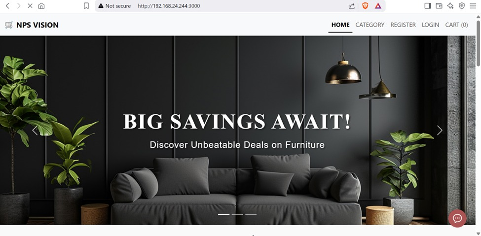

# NPS VISION - E-Commerce Application (Ecommerce-Based-AR-Website-)

A full-stack e-commerce application built with React, Node.js, Express, and MongoDB. It utilizes `<model-viewer>` to enable users to preview 3D product models in real-world environments (AR) through mobile cameras for an immersive and interactive shopping experience. The application features user and administrator roles, secure JWT authentication, password recovery, category management, and a responsive Bootstrap-based user interface.

## Table of Contents

- [Features](#features)
- [Screenshots](#screenshots)
- [Tech Stack](#tech-stack)
- [Project Structure](#project-structure)
- [Prerequisites](#prerequisites)
- [Installation & Setup](#installation--setup)
- [Environment Variables](#environment-variables)
- [Running the Application](#running-the-application)
- [Available Scripts](#available-scripts)

---

## Features

### Authentication & Authorization
- **Secure Registration & Login:** Password hashing with `bcrypt` and token-based session management using `jsonwebtoken` (JWT).
- **Password Recovery:** Security-question-based ("answer") password reset functionality.
- **Protected Routes:** Separate middleware checkups for registered users and administrators to guard sensitive routes (`/dashboard/user` and `/dashboard/admin`).

### User Interface & Experience
- **AR / 3D Viewer:** Built-in integration with `<model-viewer>` to preview product models in Augmented Reality using mobile cameras.
- **Responsive Layout:** Structured with React Bootstrap & Bootstrap for a clean mobile-first design.
- **Dynamic SEO Metadata:** Managed with `react-helmet` to handle page-specific titles, descriptions, and keywords.
- **Notifications:** Integrated toast alerts using `react-hot-toast` and `react-toastify` for clear, non-blocking user feedback.

---

## Screenshots

### Home Page


### AR / 3D Model Viewer


---

## Tech Stack

### Frontend
- **Framework:** React (v19)
- **Routing:** React Router DOM (v7)
- **AR Viewer:** `@google/model-viewer`
- **Styling:** Bootstrap (v5), React Bootstrap, Custom CSS
- **HTTP Client:** Axios for API requests
- **Metadata Management:** React Helmet

### Backend
- **Runtime Environment:** Node.js
- **Framework:** Express.js
- **Database:** MongoDB (using Mongoose ODM)
- **Authentication:** JSON Web Tokens (JWT), Bcrypt
- **Development Tooling:** Nodemon, Morgan (HTTP request logger)

---

## Project Structure

```text
ecommerce/
├── client/                 # Frontend React Application
│   ├── public/             # Static public assets
│   └── src/
│       ├── components/     # Reusable layout and routing components
│       ├── context/        # React context providers (auth, etc.)
│       ├── pages/          # Page components (Home, About, Auth, Dashboard, etc.)
│       ├── styles/         # Page-specific custom styles
│       ├── App.js          # App component and routes
│       └── index.js        # Entry point for React
├── config/                 # Database connection settings
├── controllers/            # Controller logic for endpoints
├── middlewares/            # Authentication & authorization middlewares
├── models/                 # Mongoose models (User, etc.)
├── routes/                 # API route definitions (auth, etc.)
├── server.js               # Entry point for Backend Server
├── package.json            # Root dependencies & concurrently scripts
└── .env                    # Backend environment variables
```

---

## Prerequisites

Ensure you have the following installed on your system:
- **Node.js** (v16.x or higher recommended)
- **npm** (comes packaged with Node)
- **MongoDB** (Local instance or MongoDB Atlas URI)

---

## Installation & Setup

1. **Clone the repository:**
   ```bash
   git clone <repository-url>
   cd ecommerce
   ```

2. **Install Backend Dependencies:**
   In the root directory, run:
   ```bash
   npm install
   ```

3. **Install Frontend Dependencies:**
   Navigate to the `client/` directory and install packages:
   ```bash
   cd client
   ```
   Or install them from the root using:
   ```bash
   npm install --prefix ./client
   ```

---

## Environment Variables

### Backend Configuration
Create a `.env` file in the root directory of the project and define the following variables:

```env
PORT = 8080
MONGO_URL = your_mongodb_connection_string
JWT_SECRET = your_jwt_secret_key
```

### Frontend Configuration
Create a `.env` file in the `client/` directory and configure the backend API proxy:

```env
React_APP_API = http://localhost:8080
```

---

## Running the Application

The project is configured to run both frontend and backend concurrently using the `concurrently` package from the root folder.

To start both the Express server and the React client together:
```bash
npm run dev
```

- **Backend Server** will run on: `http://localhost:8080`
- **Frontend Client** will run on: `http://localhost:3000`

---

## Available Scripts

In the root directory, you can run the following scripts:

- `npm start`: Starts the backend server with standard Node (`node server.js`).
- `npm run server`: Starts the backend server with `nodemon` for automatic restarts on code changes.
- `npm run client`: Runs the frontend React application development server.
- `npm run dev`: Runs both backend and frontend servers in parallel.
